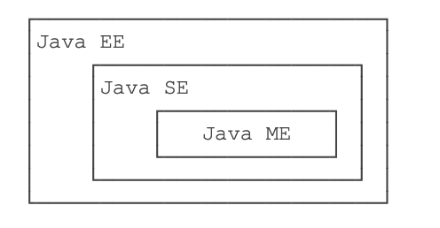
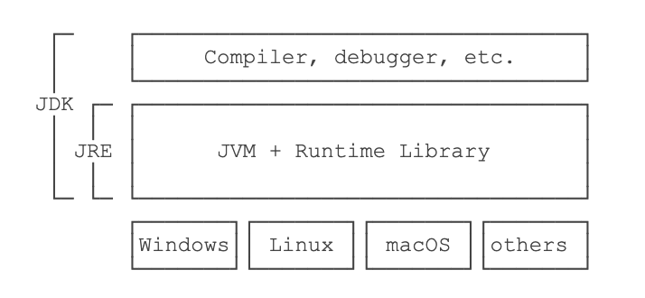

# java基础

[TOC]

[TOC]

## 一、什么是java

### 1、JavaSE



- Java SE就是标准版，包含标准的JVM和标准库，
- Java EE是企业版，它只是在Java SE的基础上加上了大量的API和库，以便方便开发Web应用、数据库、消息服务等，Java EE的应用使用的虚拟机和Java SE完全相同。
- Java ME就和Java SE不同，它是一个针对嵌入式设备的“瘦身版”，Java SE的标准库无法在Java ME上使用，Java ME的虚拟机也是“瘦身版”。

### 2、JDK与JRE



- JRE就是运行Java字节码的虚拟机。
- 但是，如果只有Java源码，要编译成Java字节码，就需要JDK；
- JDK除了包含JRE，还提供了编译器、调试器等开发工具。
- JSR是一系列的规范，从JVM的内存模型到Web程序接口，全部都标准化了。而负责审核JSR的组织就是JCP。

### 3、白皮书关键术语

- 面向对象：重点在数据对象和对象的接口上
- 网络能力：能够通过url打开和访问网络上的对象
- 健壮性：java编译器能够检测出一些其他语言仅在运行时才能检测出的错误；java不需要指针来构造数据结构，在必要时却能具有指针的能力
- 可移植性：数据类型规范
- 多线程：带来更好的交互和响应

## 二、java程序基础

### 1、基本数据类型

- 整数类型：byte，short，int，long

  - byte：-128 ~ 127
  - short: -32768 ~ 32767
  - int: -2147483648 ~ 2147483647
  - long: -9223372036854775808 ~ 9223372036854775807

- 浮点数类型：float，double

  ```java
  float f2 = 3.14e38f; // 科学计数法表示的3.14x10^38（对于float类型，需要加上f后缀。）
  double d3 = 4.9e-324; // 科学计数法表示的4.9x10^-324
  //float类型可最大表示3.4x1038，而double类型可最大表示1.79x10308。
  ```

- 字符类型：char

- 布尔类型：boolean

- 定义变量的时候，如果加上final修饰符，这个变量就变成了常量（根据习惯，常量名通常全部大写。）

### 2、计算

- 普通运算、自增自减

- 移位计算、与或运算

- 由于浮点数存在运算误差，所以比较两个浮点数是否相等常常会出现错误的结果。正确的比较方法是判断两个浮点数之差的绝对值是否小于一个很小的数:

  ```java
  double r = Math.abs(x - y);
  ```

- 溢出：`NaN`表示**Not a Number**   `Infinity`表示无穷大   `-Infinity`表示负无穷大

- 三元计算  `b ? x : y`会首先计算**b**，如果**b**为`true`，则只计算**x**，否则，只计算**y**

### 3、字符串

- `\n `表示换行符

- `\r` 表示回车符

- `\t` 表示Tab

- 从Java 13开始//预览功能//，字符串可以用`"""..."""`表示多行字符串（Text Blocks）了。举个例子：

  ```java
  String s = """
  	         SELECT * FROM
  	           users
  	         WHERE id > 100
  	         ORDER BY name DESC
             """;
  ```

  - 上述多行字符串实际上是5行，在最后一个`DESC`后面还有一个`\n`。如果我们不想在字符串末尾加一个`\n`，就需要这么写：`ORDER BY name DESC"""`;
  - 多行字符串前面共同的空格会被去掉

- 字符串匹配：两个`String`类型，它们的内容是相同的，但是，分别指向不同的对象，用`==`判断，结果为`false`，要判断引用类型的变量内容是否相等，必须使用`equals()`方法：`s1.equals(s2)`

### 4、循环和流程

- `while`循环是先判断循环条件，再执行循环。而另一种`do while`循环则是先执行循环，再判断条件，条件满足时继续循环，条件不满足时退出。

- Java还提供了另一种`for each`循环，它可以更简单地遍历数组：

  ```java
    int[]ns={1,4,9,16,25};
    for(intn:ns){
      System.*out*.println(n);
    }
  ```

- `break`和`continue`

### 5、数组操作

- 直接打印数组变量，得到的是数组在**JVM**中的引用地址
- 我们只需要调用**JDK**提供的`Arrays.sort()`就可以排序
- `Arrays.deepToString()`二维数组变字符串

## 三、面向对象编程

### 1、方法

- 可变参数用*类型...*定义，可变参数相当于数组类型：

  ```java
  public void setNames(String...names){
  	this.names=names;
  }
  ```

- 方法名相同，但各自的参数不同，称为方法重载（`Overload`）

### 2、继承

- 继承是面向对象编程中非常强大的一种机制，它首先可以复用代码。当我们让`Student`从`Person`继承时，`Student`就获得了`Person`的所有功能，我们只需要为`Student`编写新增的功能。

  ```java
  class Student extends Person {
      // 不要重复name和age字段/方法,
      // 只需要定义新增score字段/方法:
      private int score;
  
      public int getScore() { … }
      public void setScore(int score) { … }
  }
  ```

- 继承有个特点，就是子类无法访问父类的`private`字段或者`private`方法。用`protected`修饰的字段可以被子类访问;

- 这是因为在**Java**中，任何**class**的构造方法，第一行语句必须是调用父类的构造方法。如果没有明确地调用父类的构造方法，编译器会帮我们自动加一句`super()`;

- 这是因为`Student`继承自`Person`，因此，它拥有`Person`的全部功能。`Person`类型的变量，如果指向`Student`类型的实例，对它进行操作，是没有问题的！

  ```java
  Student s = new Student();
  Person p = s; // upcasting, ok
  Object o1 = p; // upcasting, ok
  Object o2 = s; // upcasting, ok
  ```

  这种把一个子类类型安全地变为父类类型的赋值，被称为向上转型（`upcasting`）。

- 向下转型很可能会失败（当出现多的功能和属性时）。失败的时候，**Java**虚拟机会报`ClassCastException`

- `instanceof`实际上判断一个变量所指向的实例是否是指定类型，或者这个类型的子类。如果一个引用变量为`null`，那么对任何`instanceof`的判断都为`false`。

  ```java
  Person p = new Student();
  if (p instanceof Student) {
      // 只有判断成功才会向下转型:
      Student s = (Student) p; // 一定会成功
  }
  ```

- 从Java 14开始，判断`instanceof`后，可以直接转型为指定变量，避免再次强制转型

  ```java
  Object obj = "hello";
  if (obj instanceof String) {
      String s = (String) obj;
      System.out.println(s.toUpperCase());
  }
  ```

### 3、组合

- 具有has关系不应该使用继承，而是使用组合，即Student可以持有一个Book实例：

  ```java
  class Student extends Person {
      protected Book book;
      protected int score;
  }
  ```

### 4、覆写

- 加上`@Override`可以让编译器帮助检查是否进行了正确的覆写。希望进行覆写，但是不小心写错了方法签名，编译器会报错。
- **Java**的实例方法调用是基于运行时的实际类型的动态调用，而非变量的声明类型。

```java
Person p = new Student();
p.run();//应该打印Student.run
```

- 多态是指，针对某个类型的方法调用，其真正执行的方法取决于运行时期实际类型的方法。多态允许添加更多类型的子类实现功能扩展，却不需要修改基于父类的代码。

### 5、final

- 如果一个父类不允许子类对它的某个方法进行覆写，可以把该方法标记为`final`。
- 如果一个类不希望任何其他类继承自它，那么可以把这个类本身标记为`final`。
- 对于一个类的实例字段，同样可以用`final`修饰。用`final`修饰的字段在初始化后不能被修改。

### 6、Object方法

- `toString()`：把`instance`输出为`String`；
- `equals()`：判断两个`instance`是否逻辑相等；
- `hashCode()`：计算一个`instance`的哈希值。

### 7、抽象类

- 把一个方法声明为`abstract`，表示它是一个抽象方法，本身没有实现任何方法语句。因为这个抽象方法本身是无法执行的，所以，`Person`类也无法被实例化。编译器会告诉我们，无法编译`Person`类，因为它包含抽象方法

  ```java
  abstract class Person {
      public abstract void run();
  }
  ```

- 因为无法执行抽象方法，因此这个类也必须申明为抽象类（`abstract class`）。

- 继承一个抽象类，就必须覆写抽象方法

### 8、接口

- 在抽象类中，抽象方法本质上是定义接口规范：即规定高层类的接口，从而保证所有子类都有相同的接口实现，如果一个抽象类没有字段，所有方法全部都是抽象方法，就可以把该抽象类改写为接口：`interface`。

  ```java
  interface Person {
      void run();
      String getName();
  }
  ```

- 当一个具体的`class`去实现一个`interface`时，需要使用`implements`关键字

  ```java
  class Student implements Person {
      private String name;
  
      public Student(String name) {
          this.name = name;
      }
  
      @Override
      public void run() {
          System.out.println(this.name + " run");
      }
  
      @Override
      public String getName() {
          return this.name;
      }
  }
  ```

  一个类可以实现多个`interface`

- Java的接口特指`interface`的定义，表示一个接口类型和一组方法签名，而编程接口泛指接口规范，如方法签名，数据格式，网络协议等。

- 一个`interface`可以继承自另一个`interface`。`interface`继承自`interface`使用`extends`

- 在接口中，可以定义`default`方法。实现类可以不必覆写default方法。default方法的目的是，当我们需要给接口新增一个方法时，会涉及到修改全部子类。如果新增的是default方法，那么子类就不必全部修改，只需要在需要覆写的地方去覆写新增方法。

### 9、静态字段和静态方法

- 在一个`class`中定义的字段，我们称之为实例字段。实例字段的特点是，每个实例都有独立的字段，各个实例的同名字段互不影响。

- 还有一种字段，是用static修饰的字段，称为静态字段：`static field`。静态字段只有一个共享“空间”，所有实例都会共享该字段。对于静态字段，无论修改哪个实例的静态字段，效果都是一样的：所有实例的静态字段都被修改了。

- 把静态字段理解成类的字段而非实例的字段。

- 调用实例方法必须通过一个实例变量，而调用静态方法则不需要实例变量，通过类名就可以调用。因为静态方法属于`class`而不属于实例，因此，静态方法内部，无法访问`this`变量，也无法访问实例字段，它只能访问静态字段。

- 因为`interface`是一个纯抽象类，所以它不能定义实例字段。但是，`interface`是可以有静态字段的，并且静态字段必须为`final`类型。实际上，因为`interface`的字段只能是`public static final`类型，所以我们可以把这些修饰符都去掉

- ```java
  public interface Person {
      // 编译器会自动加上public statc final:
      int MALE = 1;
      int FEMALE = 2;
  }
  ```

### 10、包

- **Java**定义了一种名字空间，称之为包：`package`。一个类总是属于某个包，类名（比如`Person`）只是一个简写，真正的完整类名是`包名.类名`。
- 在定义`class`的时候，我们需要在第一行声明这个`class`属于哪个包。
- 如果有两个`class`名称相同，例如，`mr.jun.Arrays`和`java.util.Arrays`，那么只能`import`其中一个，另一个必须写完整类名。
- 包作用域是指一个类允许访问同一个`package`的没有`public`、`private`修饰的`class`，以及没有`public`、`protected`、`private`修饰的字段和方法。

## 四、java核心类

### 1、String

- **Java**字符串的一个重要特点就是字符串`不可变`。

- 想比较字符串的内容是否相同。必须使用`equals()`方法`s1.equals(s2)`

- 要忽略大小写比较，使用`equalsIgnoreCase()`方法。

  ```java
  // 是否包含子串:
  "Hello".contains("ll"); // true
  //搜索子串的更多的例子：
  "Hello".indexOf("l"); // 2
  "Hello".lastIndexOf("l"); // 3
  "Hello".startsWith("He"); // true
  "Hello".endsWith("lo"); // true
  //提取子串的例子：
  "Hello".substring(2); // "llo"
  "Hello".substring(2, 4); "ll"
  ```