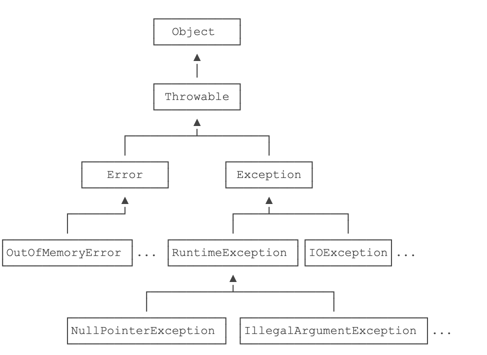
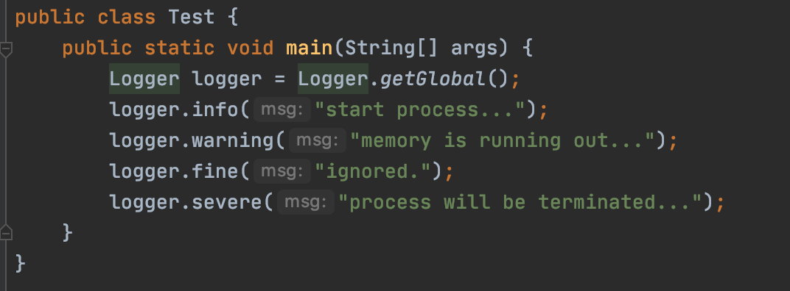
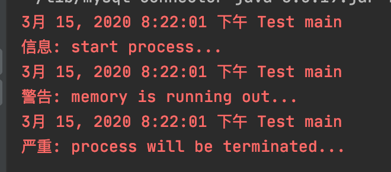

# java基础
<!-- TOC -->

- [java基础](#java基础)
    - [一、什么是java](#一什么是java)
        - [1、JavaSE](#1javase)
        - [2、JDK与JRE](#2jdk与jre)
        - [3、白皮书关键术语](#3白皮书关键术语)
    - [二、java程序基础](#二java程序基础)
        - [1、基本数据类型](#1基本数据类型)
        - [2、计算](#2计算)
        - [3、字符串](#3字符串)
        - [4、循环和流程](#4循环和流程)
        - [5、数组操作](#5数组操作)
    - [三、面向对象编程](#三面向对象编程)
        - [1、方法](#1方法)
        - [2、继承](#2继承)
        - [3、组合](#3组合)
        - [4、覆写](#4覆写)
        - [5、final](#5final)
        - [6、Object方法](#6object方法)
        - [7、抽象类](#7抽象类)
        - [8、接口](#8接口)
        - [9、静态字段和静态方法](#9静态字段和静态方法)
        - [10、包](#10包)
    - [四、java核心类](#四java核心类)
        - [1、String](#1string)
        - [2、包装类型](#2包装类型)
        - [3、枚举类](#3枚举类)
        - [4、BigInteger和BigDecimal](#4biginteger和bigdecimal)
        - [5、Math](#5math)
        - [6、Random和SecureRandom](#6random和securerandom)
    - [五、异常处理](#五异常处理)
        - [1、什么是异常](#1什么是异常)
        - [2、捕获异常](#2捕获异常)
        - [3、抛出异常](#3抛出异常)
        - [4、自定义异常](#4自定义异常)
        - [5、断言](#5断言)
        - [6、JDK logging](#6jdk-logging)
    - [六、反射](#六反射)
        - [1、Class实例](#1class实例)

<!-- /TOC -->

## 一、什么是java

### 1、JavaSE


- Java SE就是标准版，包含标准的JVM和标准库，
- Java EE是企业版，它只是在Java SE的基础上加上了大量的API和库，以便方便开发Web应用、数据库、消息服务等，Java EE的应用使用的虚拟机和Java SE完全相同。
- Java ME就和Java SE不同，它是一个针对嵌入式设备的“瘦身版”，Java SE的标准库无法在Java ME上使用，Java ME的虚拟机也是“瘦身版”。

### 2、JDK与JRE


- JRE就是运行Java字节码的虚拟机。
- 但是，如果只有Java源码，要编译成Java字节码，就需要JDK；
- JDK除了包含JRE，还提供了编译器、调试器等开发工具。
- JSR是一系列的规范，从JVM的内存模型到Web程序接口，全部都标准化了。而负责审核JSR的组织就是JCP。

### 3、白皮书关键术语

- 面向对象：重点在数据对象和对象的接口上
- 网络能力：能够通过url打开和访问网络上的对象
- 健壮性：java编译器能够检测出一些其他语言仅在运行时才能检测出的错误；java不需要指针来构造数据结构，在必要时却能具有指针的能力
- 可移植性：数据类型规范
- 多线程：带来更好的交互和响应

## 二、java程序基础

### 1、基本数据类型

- 整数类型：`byte`，`short`，`int`，`long`

  - `byte`：-128 ~ 127
  - `short`: -32768 ~ 32767
  - `int`: -2147483648 ~ 2147483647
  - `long`: -9223372036854775808 ~ 9223372036854775807

- 浮点数类型：`float`，`double`

  ```java
  float f2 = 3.14e38f; // 科学计数法表示的3.14x10^38（对于float类型，需要加上f后缀。）
  double d3 = 4.9e-324; // 科学计数法表示的4.9x10^-324
  //float类型可最大表示3.4x1038，而double类型可最大表示1.79x10308。
  ```

- 字符类型：`char`

- 布尔类型：`boolean`

- 定义变量的时候，如果加上`final`修饰符，这个变量就变成了常量（根据习惯，常量名通常全部大写。）

### 2、计算

- 普通运算、自增自减

- 移位计算、与或运算

- 由于浮点数存在运算误差，所以比较两个浮点数是否相等常常会出现错误的结果。正确的比较方法是判断两个浮点数之差的绝对值是否小于一个很小的数:

  ```java
  double r = Math.abs(x - y);
  ```

- 溢出：`NaN`表示**Not a Number**   `Infinity`表示无穷大   `-Infinity`表示负无穷大

- 三元计算  `b ? x : y`会首先计算**b**，如果**b**为`true`，则只计算**x**，否则，只计算**y**

### 3、字符串

- `\n `表示换行符

- `\r` 表示回车符

- `\t` 表示Tab

- 从Java 13开始//预览功能//，字符串可以用`"""..."""`表示多行字符串（`Text Blocks`）了。举个例子：

  ```java
  String s = """
  	         SELECT * FROM
  	           users
  	         WHERE id > 100
  	         ORDER BY name DESC
             """;
  ```

  - 上述多行字符串实际上是5行，在最后一个`DESC`后面还有一个`\n`。如果我们不想在字符串末尾加一个`\n`，就需要这么写：`ORDER BY name DESC"""`;
  - 多行字符串前面共同的空格会被去掉

- 字符串匹配：两个`String`类型，它们的内容是相同的，但是，分别指向不同的对象，用`==`判断，结果为`false`，要判断引用类型的变量内容是否相等，必须使用`equals()`方法：`s1.equals(s2)`

### 4、循环和流程

- `while`循环是先判断循环条件，再执行循环。而另一种`do while`循环则是先执行循环，再判断条件，条件满足时继续循环，条件不满足时退出。

- Java还提供了另一种`for each`循环，它可以更简单地遍历数组：

  ```java
    int[]ns={1,4,9,16,25};
    for(intn:ns){
      System.*out*.println(n);
    }
  ```

- `break`和`continue`

### 5、数组操作

- 直接打印数组变量，得到的是数组在**JVM**中的引用地址
- 我们只需要调用**JDK**提供的`Arrays.sort()`就可以排序
- `Arrays.deepToString()`二维数组变字符串

## 三、面向对象编程

### 1、方法

- 可变参数用`类型…`定义，可变参数相当于数组类型：

  ```java
  public void setNames(String...names){
  	this.names=names;
  }
  ```

- 方法名相同，但各自的参数不同，称为方法重载（`Overload`）

### 2、继承

- 继承是面向对象编程中非常强大的一种机制，它首先可以复用代码。当我们让`Student`从`Person`继承时，`Student`就获得了`Person`的所有功能，我们只需要为`Student`编写新增的功能。

  ```java
  class Student extends Person {
      // 不要重复name和age字段/方法,
      // 只需要定义新增score字段/方法:
      private int score;
  
      public int getScore() { … }
      public void setScore(int score) { … }
  }
  ```

- 继承有个特点，就是子类无法访问父类的`private`字段或者`private`方法。用`protected`修饰的字段可以被子类访问;

- 这是因为在**Java**中，任何**class**的构造方法，第一行语句必须是调用父类的构造方法。如果没有明确地调用父类的构造方法，编译器会帮我们自动加一句`super()`;

- 这是因为`Student`继承自`Person`，因此，它拥有`Person`的全部功能。`Person`类型的变量，如果指向`Student`类型的实例，对它进行操作，是没有问题的！

  ```java
  Student s = new Student();
  Person p = s; // upcasting, ok
  Object o1 = p; // upcasting, ok
  Object o2 = s; // upcasting, ok
  ```

  这种把一个子类类型安全地变为父类类型的赋值，被称为向上转型（`upcasting`）。

- 向下转型很可能会失败（当出现多的功能和属性时）。失败的时候，**Java**虚拟机会报`ClassCastException`

- `instanceof`实际上判断一个变量所指向的实例是否是指定类型，或者这个类型的子类。如果一个引用变量为`null`，那么对任何`instanceof`的判断都为`false`。

  ```java
  Person p = new Student();
  if (p instanceof Student) {
      // 只有判断成功才会向下转型:
      Student s = (Student) p; // 一定会成功
  }
  ```

- 从Java 14开始，判断`instanceof`后，可以直接转型为指定变量，避免再次强制转型

  ```java
  Object obj = "hello";
  if (obj instanceof String) {
      String s = (String) obj;
      System.out.println(s.toUpperCase());
  }
  ```

### 3、组合

- 具有has关系不应该使用继承，而是使用组合，即Student可以持有一个Book实例：

  ```java
  class Student extends Person {
      protected Book book;
      protected int score;
  }
  ```

### 4、覆写

- 加上`@Override`可以让编译器帮助检查是否进行了正确的覆写。希望进行覆写，但是不小心写错了方法签名，编译器会报错。
- **Java**的实例方法调用是基于运行时的实际类型的动态调用，而非变量的声明类型。

```java
Person p = new Student();
p.run();//应该打印Student.run
```

- 多态是指，针对某个类型的方法调用，其真正执行的方法取决于运行时期实际类型的方法。多态允许添加更多类型的子类实现功能扩展，却不需要修改基于父类的代码。

### 5、final

- 如果一个父类不允许子类对它的某个方法进行覆写，可以把该方法标记为`final`。
- 如果一个类不希望任何其他类继承自它，那么可以把这个类本身标记为`final`。
- 对于一个类的实例字段，同样可以用`final`修饰。用`final`修饰的字段在初始化后不能被修改。

### 6、Object方法

- `toString()`：把`instance`输出为`String`；
- `equals()`：判断两个`instance`是否逻辑相等；
- `hashCode()`：计算一个`instance`的哈希值。

### 7、抽象类

- 把一个方法声明为`abstract`，表示它是一个抽象方法，本身没有实现任何方法语句。因为这个抽象方法本身是无法执行的，所以，`Person`类也无法被实例化。编译器会告诉我们，无法编译`Person`类，因为它包含抽象方法

  ```java
  abstract class Person {
      public abstract void run();
  }
  ```

- 因为无法执行抽象方法，因此这个类也必须申明为抽象类（`abstract class`）。

- 继承一个抽象类，就必须覆写抽象方法

### 8、接口

- 在抽象类中，抽象方法本质上是定义接口规范：即规定高层类的接口，从而保证所有子类都有相同的接口实现，如果一个抽象类没有字段，所有方法全部都是抽象方法，就可以把该抽象类改写为接口：`interface`。

  ```java
  interface Person {
      void run();
      String getName();
  }
  ```

- 当一个具体的`class`去实现一个`interface`时，需要使用`implements`关键字

  ```java
  class Student implements Person {
      private String name;
  
      public Student(String name) {
          this.name = name;
      }
  
      @Override
      public void run() {
          System.out.println(this.name + " run");
      }
  
      @Override
      public String getName() {
          return this.name;
      }
  }
  ```

  一个类可以实现多个`interface`

- Java的接口特指`interface`的定义，表示一个接口类型和一组方法签名，而编程接口泛指接口规范，如方法签名，数据格式，网络协议等。

- 一个`interface`可以继承自另一个`interface`。`interface`继承自`interface`使用`extends`

- 在接口中，可以定义`default`方法。实现类可以不必覆写default方法。default方法的目的是，当我们需要给接口新增一个方法时，会涉及到修改全部子类。如果新增的是default方法，那么子类就不必全部修改，只需要在需要覆写的地方去覆写新增方法。

### 9、静态字段和静态方法

- 在一个`class`中定义的字段，我们称之为实例字段。实例字段的特点是，每个实例都有独立的字段，各个实例的同名字段互不影响。

- 还有一种字段，是用static修饰的字段，称为静态字段：`static field`。静态字段只有一个共享“空间”，所有实例都会共享该字段。对于静态字段，无论修改哪个实例的静态字段，效果都是一样的：所有实例的静态字段都被修改了。

- 把静态字段理解成类的字段而非实例的字段。

- 调用实例方法必须通过一个实例变量，而调用静态方法则不需要实例变量，通过类名就可以调用。因为静态方法属于`class`而不属于实例，因此，静态方法内部，无法访问`this`变量，也无法访问实例字段，它只能访问静态字段。

- 因为`interface`是一个纯抽象类，所以它不能定义实例字段。但是，`interface`是可以有静态字段的，并且静态字段必须为`final`类型。实际上，因为`interface`的字段只能是`public static final`类型，所以我们可以把这些修饰符都去掉

- ```java
  public interface Person {
      // 编译器会自动加上public statc final:
      int MALE = 1;
      int FEMALE = 2;
  }
  ```

### 10、包

- **Java**定义了一种名字空间，称之为包：`package`。一个类总是属于某个包，类名（比如`Person`）只是一个简写，真正的完整类名是`包名.类名`。
- 在定义`class`的时候，我们需要在第一行声明这个`class`属于哪个包。
- 如果有两个`class`名称相同，例如，`mr.jun.Arrays`和`java.util.Arrays`，那么只能`import`其中一个，另一个必须写完整类名。
- 包作用域是指一个类允许访问同一个`package`的没有`public`、`private`修饰的`class`，以及没有`public`、`protected`、`private`修饰的字段和方法。

## 四、java核心类

### 1、String

- **Java**字符串的一个重要特点就是字符串`不可变`。

- 想比较字符串的内容是否相同。必须使用`equals()`方法`s1.equals(s2)`

- 要忽略大小写比较，使用`equalsIgnoreCase()`方法。

  ```java
  // 是否包含子串:
  "Hello".contains("ll"); // true
  //搜索子串的更多的例子：
  "Hello".indexOf("l"); // 2
  "Hello".lastIndexOf("l"); // 3
  "Hello".startsWith("He"); // true
  "Hello".endsWith("lo"); // true
  //提取子串的例子：
  "Hello".substring(2); // "llo"
  "Hello".substring(2, 4); "ll"
  ```
  
- 使用`trim()`方法可以移除字符串首尾空白字符。空白字符包括空格，`\t`，`\r`，`\n`：

  ```java
  "  \tHello\r\n ".trim(); // "Hello"
  ```

- `String`还提供了`isEmpty()`和`isBlank()`来判断字符串是否为空和空白字符串：

- ```java
  "".isEmpty(); // true，因为字符串长度为0
  "  ".isEmpty(); // false，因为字符串长度不为0
  "  \n".isBlank(); // true，因为只包含空白字符
  " Hello ".isBlank(); // false，因为包含非空白字符
  ```

- 要在字符串中替换子串，有两种方法。一种是根据字符或字符串替换：

- ```java
  String s = "hello";
  s.replace('l', 'w'); // "hewwo"，所有字符'l'被替换为'w'
  s.replace("ll", "~~"); // "he~~o"，所有子串"ll"被替换为"~~"
  ```

  另一种是通过正则表达式替换：

  ```java
  String s = "A,,B;C ,D";
  s.replaceAll("[\\,\\;\\s]+", ","); // "A,B,C,D"
  ```

- 要分割字符串，使用`split()`方法，并且传入的也是正则表达式：

  ```java
  String s = "A,B,C,D";
  String[] ss = s.split("\\,"); // {"A", "B", "C", "D"}
  ```

- 拼接字符串使用静态方法`join()`，它用指定的字符串连接字符串数组：

  ```java
  String[] arr = {"A", "B", "C"};
  String s = String.join("***", arr); // "A***B***C"
  ```

- 要把任意基本类型或引用类型转换为字符串，可以使用静态方法`valueOf()`。这是一个重载方法，编译器会根据参数自动选择合适的方法：

- ```java
  String.valueOf(123); // "123"
  String.valueOf(45.67); // "45.67"
  String.valueOf(true); // "true"
  String.valueOf(new Object()); // 类似java.lang.Object@636be97c
  ```

- 要把字符串转换为其他类型，就需要根据情况。`parseInt`

- `String`和`char[]`类型可以互相转换，方法是：

- ```java
  char[] cs = "Hello".toCharArray(); // String -> char[]
  String s = new String(cs); // char[] -> String
  ```

  如果修改了`char[]`数组，`String`并不会改变,采用复制一份的方法。

- 在Java中，`char`类型实际上就是两个字节的`Unicode`编码。如果我们要手动把字符串转换成其他编码，可以这样做：

- ```java
  byte[] b1 = "Hello".getBytes(); // 按系统默认编码转换，不推荐
  byte[] b2 = "Hello".getBytes("UTF-8"); // 按UTF-8编码转换
  byte[] b2 = "Hello".getBytes("GBK"); // 按GBK编码转换
  byte[] b3 = "Hello".getBytes(StandardCharsets.UTF_8); // 按UTF-8编码转换
  ```

  如果要把已知编码的`byte[]`转换为`String`，可以这样做：

  ```java
  byte[] b = ...
  String s1 = new String(b, "GBK"); // 按GBK转换
  String s2 = new String(b, StandardCharsets.UTF_8); // 按UTF-8转换
  ```

- Java编译器对`String`做了特殊处理，使得我们可以直接用`+`拼接字符串

- 为了能高效拼接字符串，Java标准库提供了`StringBuilder`它是一个可变对象，可以预分配缓冲区，

- ```java
  StringBuilder sb = new StringBuilder(1024);
  for (int i = 0; i < 1000; i++) {
      sb.append(',');
      sb.append(i);
  }
  String s = sb.toString();
  ```

  `StringBuilder`还可以进行链式操作：

  ```java
   var sb = new StringBuilder(1024);
          sb.append("Mr ")
            .append("Bob")
            .append("!")//Mr.Bob!
            .insert(0, "Hello, ");//Hello,Mr.Bob!
  ```

  进行链式操作的关键是，定义的`append()`方法会返回`this`

- `String`还提供了一个静态方法`join()`

- ```java
  String[] names = {"Bob", "Alice", "Grace"};
  var s = String.join(", ", names);
  ```

### 2、包装类型

- 基本类型：`byte`，`short`，`int`，`long`，`boolean`，`float`，`double`，`char`。引用类型可以赋值为`null`，表示空，但基本类型不能赋值为`null`

- 比如，想要把`int`基本类型变成一个引用类型，我们可以定义一个`Integer`类，它只包含一个实例字段`int`，这样，`Integer`类就可以视为`int`的包装类（`Wrapper Class`）

  ```java
  public class Integer {
      private int value;
  
      public Integer(int value) {
          this.value = value;
      }
  
      public int intValue() {
          return this.value;
      }
  }
  ```

- 实际上，因为包装类型非常有用，Java核心库为每种基本类型都提供了对应的包装类型：

  

- 因为`int`和`Integer`可以互相转换，所以，**Java**编译器可以帮助我们自动在`int`和`Integer`之间转型，这种直接把`int`变为`Integer`的赋值写法，称为自动装箱（`Auto Boxing`），反过来，把`Integer`变为`int`的赋值写法，称为自动拆箱（`Auto Unboxing`）。

- 所有的包装类型都是不变类。对两个`Integer`实例进行比较要特别注意：绝对不能用`==`比较，因为`Integer`是引用类型，必须使用`equals()`比较。

- 因为`Integer.valueOf()`可能始终返回同一个`Integer`实例，因此，在我们自己创建`Integer`的时候，以下两种方法：

- - 方法1：`Integer n = new Integer(100)`;
  - 方法2：`Integer n = Integer.valueOf(100)`
  - `方法2`更好，因为`方法1`总是创建新的`Integer`实例，`方法2`把内部优化留给`Integer`的实现者去做，即使在当前版本没有优化，也有可能在下一个版本进行优化。

  - 我们把能创建“新”对象的静态方法称为静态工厂方法。`Integer.valueOf()`就是静态工厂方法，它尽可能地返回缓存的实例以节省内存。

- `Integer`类本身还提供了大量方法，例如，最常用的静态方法`parseInt()`可以把字符串解析成一个整数。`Integer`还可以把整数格式化为指定进制的字符串。

  ```java
  Integer.toString(100,36);//"2s",表示36进制
  ```

- **Java**的包装类型还定义了一些有用的静态变量

- ```java
  // boolean只有两个值true/false，其包装类型只需要引用Boolean提供的静态字段:
  Boolean t = Boolean.TRUE;
  Boolean f = Boolean.FALSE;
  // int可表示的最大/最小值:
  int max = Integer.MAX_VALUE; // 2147483647
  int min = Integer.MIN_VALUE; // -2147483648
  // long类型占用的bit和byte数量:
  int sizeOfLong = Long.SIZE; // 64 (bits)
  int bytesOfLong = Long.BYTES; // 8 (bytes)
  ```

- 最后，所有的整数和浮点数的包装类型都继承自`Number`，因此，可以非常方便地直接通过包装类型获取各种基本类型：

- ```java
  // 向上转型为Number:
  Number num = new Integer(999);
  // 获取byte, int, long, float, double:
  byte b = num.byteValue();
  int n = num.intValue();
  long ln = num.longValue();
  float f = num.floatValue();
  double d = num.doubleValue();
  ```

### 3、枚举类

- 为了让编译器能自动检查某个值在枚举的集合内，并且，不同用途的枚举需要不同的类型来标记，不能混用，我们可以使用`enum`来定义枚举类

- ```java
  public class Main {
      public static void main(String[] args) {
          Weekday day = Weekday.SUN;
          if (day == Weekday.SAT || day == Weekday.SUN) {
              System.out.println("Work at home!");
          } else {
              System.out.println("Work at office!");
          }
      }
  }
  
  enum Weekday {
      SUN, MON, TUE, WED, THU, FRI, SAT;
  }
  ```

  注意到定义枚举类是通过关键字`enum`实现的，我们只需依次列出枚举的常量名。首先，`enum`常量本身带有类型信息，即`Weekday.SUN`类型是`Weekday`，编译器会自动检查出类型错误。不同类型的枚举不能互相比较或者赋值，因为类型不符。

- 因为`enum`类型的每个常量在JVM中只有一个唯一实例，所以可以直接用`==`比较：

- 和其他`class`的区别

- - 定义的`enum`类型总是继承自`java.lang.Enum`，且无法被继承；
  - 只能定义出`enum`的实例，而无法通过`new`操作符创建`enum`的实例；
  - 定义的每个实例都是引用类型的唯一实例；
  - 可以将`enum`类型用于`switch`语句。

- 一些方法：

- - `String s = Weekday.SUN.name(); // "SUN"`
  - `int n = Weekday.MON.ordinal(); // 1`
  - 默认情况下，对枚举常量调用`toString()`会返回和`name()`一样的字符串。但是，`toString()`可以被覆写，而`name()`则不行。我们可以给`Weekday`添加`toString()`方法：

- 我们可以定义`private`的构造方法，并且，给每个枚举常量添加字段

  ```java
  enum Weekday {
    MON(1), TUE(2), WED(3), THU(4), FRI(5), SAT(6), SUN(0);
  	public final int dayValue;
  
  	private Weekday(int dayValue) {
      this.dayValue = dayValue;
  	}
  }
  ```
  这样就无需担心顺序的变化，新增枚举常量时，也需要指定一个int值。

### 4、BigInteger和BigDecimal

- 如果我们使用的整数范围超过了`long`型怎么办？这个时候，就只能用软件来模拟一个大整数。`java.math.BigInteger`就是用来表示任意大小的整数。`BigInteger`内部用一个`int[]`数组来模拟一个非常大的整数：

- 对`BigInteger`做运算的时候，只能使用实例方法，例如，加法运算

- ```java
  BigInteger i1 = new BigInteger("1234567890");
  BigInteger i2 = new BigInteger("12345678901234567890");
  BigInteger sum = i1.add(i2); // 12345678902469135780
  ```

- `BigInteger`和`Integer`、`Long`一样，也是不可变类，并且也继承自`Number`类。

  - 转换为`byte`：`byteValue()`
  - 转换为`short`：`shortValue()`
  - 转换为`int`：`intValue()`
  - 转换为`long`：`longValue()`
  - 转换为`float`：`floatValue()`
  - 转换为`double`：`doubleValue()`

  通过上述方法，可以把`BigInteger`转换成基本类型。如果`BigInteger`表示的范围超过了基本类型的范围，转换时将丢失高位信息，即结果不一定是准确的。如果需要准确地转换成基本类型，可以使用`intValueExact()`、`longValueExact()`等方法，在转换时如果超出范围，将直接抛出`ArithmeticException`异常。

- 和`BigInteger`类似，`BigDecimal`可以表示一个任意大小且精度完全准确的浮点数。`BigDecimal`用`scale()`表示小数位数

  ```java
  BigDecimal d1 = new BigDecimal("123.45");
  BigDecimal d2 = new BigDecimal("123.4500");
  BigDecimal d3 = new BigDecimal("1234500");
  System.out.println(d1.scale()); // 2,两位小数
  System.out.println(d2.scale()); // 4
  System.out.println(d3.scale()); // 0
  ```

  如果一个`BigDecimal`的`scale()`返回负数，例如，`-2`，表示这个数是个整数，并且末尾有2个`0`。

- 可以对一个`BigDecimal`设置它的`scale`，如果精度比原始值低，那么按照指定的方法进行四舍五入或者直接截断：

  ```java
  BigDecimal d1 = new BigDecimal("123.456789");
  BigDecimal d2 = d1.setScale(4, RoundingMode.HALF_UP); // 四舍五入，123.4568
  BigDecimal d3 = d1.setScale(4, RoundingMode.DOWN); // 直接截断，123.4567
  ```

- 在比较两个`BigDecimal`的值是否相等时，要特别注意，使用`equals()`方法不但要求两个`BigDecimal`的值相等，还要求它们的`scale()`相等
- 使用`compareTo()`方法来比较，它根据两个值的大小分别返回`负数`、`正数`和`0`，分别表示小于、大于和等于。

### 5、Math

- 求绝对值： `Math.abs(-100); // 100`
                      `Math.abs(-7.8); // 7.8`
- 取最大或最小值：`Math.max(100, 99); // 100`
                                 `Math.min(1.2, 2.3); // 1.2`
- 计算`x`y次方：`Math.pow(2,      10); // 2的10次方=1024`
- 计算`√x`：`Math.sqrt(2);      // 1.414…`
- 计算`e`x次方：`Math.exp(2);      // 7.389…`
- 计算以`e`为底的对数：`Math.log(4);      // 1.386…`
- 计算以10为底的对数：`Math.log10(100);      // 2`
- 三角函数：`Math.sin(3.14); // 0.00159…`
                    ` Math.cos(3.14); // -0.9999...`
                    ` Math.tan(3.14); // -0.0015…`
                    ` Math.asin(1.0); // 1.57079...`
                     `Math.acos(1.0); // 0.0`
- 几个数学常量：`double pi = Math.PI; // 3.14159…`
                            ` double e = Math.E; // 2.7182818…`
                             `Math.sin(Math.PI / 6); // sin(π/6) = 0.5`
- 生成一个随机数`x`，`x`的范围是`0 <= x < 1`：`Math.random(); //      0.53907...      `每次都不一样

### 6、Random和SecureRandom

- Random用来创建伪随机数。所谓伪随机数，是指只要给定一个初始的种子，产生的随机数序列是完全一样的。

  ```java
  Random r = new Random();
  r.nextInt(); // 2071575453,每次都不一样
  r.nextInt(10); // 5,生成一个[0,10)之间的int
  r.nextLong(); // 8811649292570369305,每次都不一样
  r.nextFloat(); // 0.54335...生成一个[0,1)之间的float
  r.nextDouble(); // 0.3716...生成一个[0,1)之间的double
  ```

- 这是因为我们创建`Random`实例时，如果不给定种子，就使用系统当前时间戳作为种子，因此每次运行时，种子不同，得到的伪随机数序列就不同。如果我们在创建`Random`实例时指定一个种子，就会得到完全确定的随机数序列

  ```java
  Random r = new Random(12345);
  ```

- `Math.random()`实际上内部调用了`Random`类，所以它也是伪随机数，只是我们无法指定种子。

- `SecureRandom`是用来创建安全的随机数的

- ```java
  SecureRandom sr = new SecureRandom();
  System.out.println(sr.nextInt(100));
  ```

- `SecureRandom`无法指定种子，它使用`RNG`（`random number generator`）算法。`SecureRandom`的安全性是通过操作系统提供的安全的随机种子来生成随机数。这个种子是通过CPU的热噪声、读写磁盘的字节、网络流量等各种随机事件产生的“熵”。

## 五、异常处理

### 1、什么是异常

- 所谓错误，就是程序调用某个函数的时候，如果失败了，就表示出错。调用方如何获知调用失败的信息？有两种方法：

- - 方法一：约定返回错误码。
  - 方法二：在语言层面上提供一个异常处理机制。

- Java内置了一套异常处理机制，总是使用异常来表示错误。异常是一种`class`，因此它本身带有类型信息。异常可以在任何地方抛出，但只需要在上层捕获，这样就和方法调用分离了：

  ```java
  try {
      String s = processFile(“C:\\test.txt”);
      // ok:
  } catch (FileNotFoundException e) {
      // file not found:
  } catch (SecurityException e) {
      // no read permission:
  } catch (IOException e) {
      // io error:
  } catch (Exception e) {
      // other error:
  }
  ```

- 

- `Throwable`是异常体系的根，`Throwable`有两个体系：`Error`和`Exception`，

- - `Error`表示严重的错误，程序对此一般无能为力，
  - 而`Exception`则是运行时的错误，它可以被捕获并处理。

- 必须捕获的异常，包括`Exception`及其子类，但不包括`RuntimeException`及其子类，这种类型的异常称为`Checked Exception`。

- 不需要捕获的异常，包括`Error`及其子类，`RuntimeException`及其子类。

### 2、捕获异常

- 捕获异常使用`try...catch`语句，把可能发生异常的代码放到`try {…}`中，然后使用`catch`捕获对应的`Exception`及其子类：

- 还有一些童鞋喜欢在函数内部“消化”异常：

  ```java
  static byte[] toGBK(String s) {
      try {
          return s.getBytes("GBK");
      } catch (UnsupportedEncodingException e) {
          // 什么也不干
      }
      return null;
  ```

- 可以使用多个`catch`语句，每个`catch`分别捕获对应的`Exception`及其子类。**JVM**在捕获到异常后，会从上到下匹配`catch`语句，匹配到某个`catch`后，执行`catch`代码块，然后不再继续匹配。存在多个`catch`的时候，`catch`的顺序非常重要：子类必须写在前面。

- 那么如何消除这些重复的代码？**Java**的`try … catch`机制还提供了`finally`语句，`finally`语句块保证有无错误都会执行。`finally`语句不是必须的，可写可不写；`finally`总是最后执行。

- 某些情况下，可以没有`catch`，只使用`try … finally`结构。

- 如果处理某两个异常的代码是相同的，所以我们可以把它两用`|`合并到一起

### 3、抛出异常

- 需要捕获异常的语句，一般在定义时会抛出一个异常：

- ```java
  public byte[] getBytes(String charsetName) throws UnsupportedEncodingException{
    ....
  }
  ```

- 如果是测试代码，`try`的写法就略显麻烦。如果不想写任何`try`代码，可以直接把`main()`方法定义为`throws Exception`。因为`main()`方法声明了可能抛出`Exception`，也就声明了可能抛出所有的`Exception`，因此在内部就无需捕获了。代价就是一旦发生异常，程序会立刻退出

- 通过`printStackTrace()`可以打印出方法的调用栈

- 当发生错误时，例如，用户输入了非法的字符，我们就可以抛出异常

  ```java
  void process2(String s) {
      if (s==null) {
          throw new NullPointerException();
      }
  }
  ```

- 如果一个方法捕获了某个异常后，又在`catch`子句中抛出新的异常，就相当于把抛出的异常类型“转换”了。但是新的异常丢失了原始异常信息，我们已经看不到原始异常的信息了。为了能追踪到完整的异常栈，在构造异常的时候，把原始的`Exception`实例作为参数传进去。**捕获到异常并再次抛出时，一定要留住原始异常，否则很难定位第一案发现场！**

- `finally`抛出异常后，原来在`catch`中准备抛出的异常就“消失”了，因为只能抛出一个异常。没有被抛出的异常称为“被屏蔽”的异常（`Suppressed Exception`）我们一般先用`origin`变量保存原始异常，然后调用`Throwable.addSuppressed()`，把原始异常添加进来，最后在`finally`抛出

### 4、自定义异常

- 自定义一个`BaseException`作为“根异常”，然后，派生出各种业务类型的异常。`BaseException`需要从一个适合的`Exception`派生，通常建议从`RuntimeException`派生

### 5、断言

- 语句`assert x >= 0`;即为断言，断言条件`x >= 0`预期为`true`。如果计算结果为`false`，则断言失败，抛出`AssertionError`。
- Java断言的特点是：断言失败时会抛出`AssertionError`，导致程序结束退出。因此，断言不能用于可恢复的程序错误，只应该用于开发和测试阶段。
- 断言需要命令行开启。

### 6、JDK logging

- 输出日志，而不是用`System.out.println()`，有以下几个好处：

- 1. 可以设置输出样式，避免自己每次都写"ERROR: " + var；
  2. 可以设置输出级别，禁止某些级别输出。例如，只输出错误日志；
  3. 可以被重定向到文件，这样可以在程序运行结束后查看日志；
  4. 可以按包名控制日志级别，只输出某些包打的日志；
  5. 可以……

- 

- 

- 和Java标准库提供的日志不同，`Commons Logging`是一个第三方日志库，它是由Apache创建的日志模块。
- 使用`Commons Logging`只需要和两个类打交道，并且只有两步：第一步，通过`LogFactory`获取`Log`类的实例； 第二步，使用`Log`实例的方法打日志。（需要apache的第三方包）
- `Log4j`是一种非常流行的日志框架，最新版本是2.x。当我们使用`Log4j`输出一条日志时，`Log4j`自动通过不同的`Appender`把同一条日志输出到不同的目的地。

## 六、反射

### 1、Class实例

- `class`是由**JVM**在执行过程中动态加载的。**JVM**在第一次读取到一种`class`类型时，将其加载进内存。每加载一种`class`，**JVM**就为其创建一个`Class`类型的实例，并关联起来。这个`Class`实例是**JVM**内部创建的，如果我们查看**JDK**源码，可以发现`Class`类的构造方法是`private`，只有**JVM**能创建`Class`实例，我们自己的**Java**程序是无法创建`Class`实例的。

- 由于JVM为每个加载的`class`创建了对应的`Class`实例，并在实例中保存了该`class`的所有信息，包括类名、包名、父类、实现的接口、所有方法、字段等，因此，如果获取了某个`Class`实例，我们就可以通过这个`Class`实例获取到该实例对应的`class`的所有信息。这种通过`Class`实例获取`class`信息的方法称为反射（`Reflection`）

- 如何获取一个`class`的`Class`实例？有三个方法：

- - 直接通过一个`class`的静态变量`class`获取：`Class cls = String.class;`
  - 如果我们有一个实例变量，可以通过该实例变量提供的`getClass()`方法获取：`String s = "Hello"; Class cls = s.getClass();`
  - 如果知道一个`class`的完整类名，可以通过静态方法`Class.forName()`获取：`Class cls = Class.forName("java.lang.String");`
  
- 对任意的一个`Object`实例，只要我们获取了它的`Class`，就可以获取它的一切信息

- 我们先看看如何通过`Class`实例获取字段信息。`Class`类提供了以下几个方法来获取字段：
  - `Field getField(name)`：根据字段名获取某个`public`的`field`（包括父类）
  - `Field getDeclaredField(name)`：根据字段名获取当前类的某个`field`（不包括父类）
  - `Field[] getFields()`：获取所有`public`的`field`（包括父类）
  - `Field[] getDeclaredFields()`：获取当前类的所有`field`（不包括父类）
  
- ```java
   Class stdClass = Student.class;
   // 获取public字段"score":
   System.out.println(stdClass.getField("score"));//public int Student.score
   // 获取继承的public字段"name":
   System.out.println(stdClass.getField("name"));//public java.lang.String Person.name
   // 获取private字段"grade":
   System.out.println(stdClass.getDeclaredField("grade"));//private int Student.grade
  
  ```

  ```java
  class Student extends Person {
      public int score;
      private int grade;
  }
  
  class Person {
      public String name;
  }
  ```

- 一个`Field`对象包含了一个字段的所有信息：

  - `getName()`：返回字段名称，例如，`"name"`；
  - `getType()`：返回字段类型，也是一个`Class`实例，例如，`String.class`；
  - `getModifiers()`：返回字段的修饰符，它是一个`int`，不同的bit表示不同的含义。

- ```java
  public final class String {
      private final byte[] value;
  }
  
  Field f = String.class.getDeclaredField("value");
  f.getName(); // "value"
  f.getType(); // class [B 表示byte[]类型
  int m = f.getModifiers();
  Modifier.isFinal(m); // true
  Modifier.isPublic(m); // false
  Modifier.isProtected(m); // false
  Modifier.isPrivate(m); // true
  Modifier.isStatic(m); // false
  ```

- 用`Field.get(Object)`获取指定实例的指定字段的值。在调用`Object value = f.get(p);`前，先写一句：`Field.setAccessible(true)`。调用`Field.setAccessible(true)`的意思是，别管这个字段是不是`public`，一律允许访问。由此一来，反射可以获取`private`字段的值。但是`setAccessible`有时也会失败。

- 通过Field实例既然可以获取到指定实例的字段值，自然也可以设置字段的值。设置字段值是通过`Field.set(Object, Object)`实现的，

- ```java
  Person p = new Person("Xiao Ming");
          System.out.println(p.getName()); // "Xiao Ming"
          Class c = p.getClass();
          Field f = c.getDeclaredField("name");
          f.setAccessible(true);
          f.set(p, "Xiao Hong");
          System.out.println(p.getName()); // "Xiao Hong"
  ```

### 2、class实例调用

- `Class`类提供了以下几个方法来获取`Method`：
  - `Method getMethod(name, Class...)`：获取某个`public`的`Method`（包括父类）
  - `Method getDeclaredMethod(name, Class...)`：获取当前类的某个`Method`（不包括父类）
  - `Method[] getMethods()`：获取所有`public`的`Method`（包括父类）
  - `Method[] getDeclaredMethods()`：获取当前类的所有`Method`（不包括父类）
- 一个`Method`对象包含一个方法的所有信息：
  - `getName()`：返回方法名称，例如：`"getScore"`；
  - `getReturnType()`：返回方法返回值类型，也是一个Class实例，例如：`String.class`；
  - `getParameterTypes()`：返回方法的参数类型，是一个Class数组，例如：`{String.class, int.class}`；
  - `getModifiers()`：返回方法的修饰符，它是一个`int`，不同的bit表示不同的含义。
- 对`Method`实例调用`invoke`就相当于调用该方法，`invoke`的第一个参数是对象实例，即在哪个实例上调用该方法，后面的可变参数要与方法参数一致，否则将报错。
- 为了调用非public方法，我们通过`Method.setAccessible(true)`允许其调用